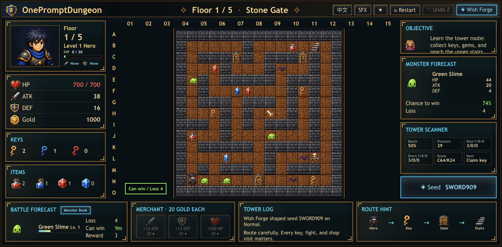

# OnePromptDungeon

[Play now](https://nothingyl.github.io/OnePromptDungeon/) · [Community seeds](docs/seeds/community-seeds.json) · [Roadmap](docs/ROADMAP.md)

OnePromptDungeon is a browser-playable, prompt/seed-generated Magic Tower-like route puzzle designed for GitHub Pages.

v1.0 is the Shareable Challenge Launch: generate a five-floor tower, clear it for a local challenge rank, export Replay JSON, download a share card, and submit community seeds by pull request. The game remains fully static: no login, backend, or API key is required.



## Play

Online build:

```txt
https://nothingyl.github.io/OnePromptDungeon/
```

No login, backend, or API key is required.

## Run Locally

```bash
git clone https://github.com/NOTHINGYL/OnePromptDungeon.git
cd OnePromptDungeon
npm install
npm run dev
```

Build the static GitHub Pages site:

```bash
npm run build
```

Run tests:

```bash
npm test
```

## Controls

- Move: `WASD`, arrow keys, or on-screen arrow buttons
- Undo: `Z` or the `Undo` button
- Language: use the title-bar language button to switch `中文 / English`
- Theme: use the title-bar theme button to switch classic light/dark
- SFX: use the title-bar sound button to toggle local Web Audio feedback
- Wish Forge: click the `Wish Forge` button or press `I` to open the local generator
- Seed Gallery: open Wish Forge and load a curated route puzzle such as Boss Rush, Merchant Economy, Sword First, or One HP Escape
- Monster Book: use the `Monster Book` button in Battle Forecast to inspect remaining monsters on the current floor
- Shop: stand on the merchant tile and buy ATK, DEF, or HP upgrades
- Result sharing: clear or fail a run to copy challenge text, download an SVG share card, or export Replay JSON
- Goal: climb to 5F, gather weapons and shields, defeat the Crystal Warden, and rescue the princess

## What v1.0 Includes

- Challenge Rank: run results now score `S/A/B/C/D` from win state, moves, HP left, difficulty, pressure, and shop usage
- Share Card: result panel can download a generated SVG card for the seed, rank, pressure, and route identity
- Copy Result: result panel can copy a short challenge text with replayable URL
- Replay JSON: movement, shop, undo, generator, and gallery actions are recorded as compact replay steps
- Community seed format: `docs/seeds/community-seeds.json` documents curated seed entries for PR submissions
- README launch polish: Play Now link, screenshot, feature summary, curated seed table, and contribution notes

## Curated Challenges

| Name | Seed | Difficulty | Identity |
| --- | --- | --- | --- |
| Beginner Tower | `BEGIN009` | Easy | Key puzzle + equipment |
| Key Starvation | `KEYS0909` | Normal | Key pressure + shop route |
| Boss Rush | `BOSS0909` | Hard | Boss rush + combat |
| Merchant Economy | `SHOP0909` | Normal | Shop route + combat |
| Sword First | `SWORD909` | Normal | Weapon route |
| Shield First | `SHIELD09` | Normal | Shield route |
| Treasure Trap | `TRAP0909` | Hard | Treasure + key puzzle |
| One HP Escape | `ONEHP909` | Hard | Combat + precision |

## Submit A Seed

Add an entry to [docs/seeds/community-seeds.json](docs/seeds/community-seeds.json) with:

- `name`
- `seed`
- `difficulty`
- `wish`
- `tags`
- `description`

Then open a pull request. Good seeds should be five-floor, reproducible, solvable, and have a clear route identity.

## What v0.9 Includes

- Curated Seed Gallery with 8 one-click tower identities: Beginner Tower, Key Starvation, Boss Rush, Merchant Economy, Sword First, Shield First, Treasure Trap, and One HP Escape
- Real EXP and level growth: monsters grant EXP, level-ups increase HP, ATK, and DEF, and undo restores growth state
- Tower Scanner now shows route pressure and dominant route dependencies instead of only raw reachability
- Wish Forge seed report now includes pressure score and route identity labels
- Generator seed version updated so v0.9 seeds better reflect the new route identity model
- Default save key moved to `opd.save.v0.9` so older local saves do not mask the new v0.9 boot state
- Updated tests for EXP, level-up undo, pressure scoring, seed identity, and i18n logs

## What v0.8 Includes

- Five persistent 15x15 floors with the final boss and princess moved to 5F
- Equipment pickups: Iron Sword, Silver Sword, Iron Shield, and Silver Shield
- Hero HUD now shows the current weapon and shield while undo restores equipment state
- Wish Forge generation, seed summaries, and Tower Scanner hints now understand equipment rewards
- Route Hint can recommend weapon or shield targets when they are reachable
- Canvas equipment rendering for map rewards without requiring a new sprite sheet
- Save compatibility for older towers that do not yet contain weapon or shield fields
- Updated README, changelog, roadmap, package version, tests, and local v0.8 notes

## What v0.7 Includes

- Canvas feedback events for combat hits, damage numbers, item pickups, door opens, blocked movement, stairs, shop purchases, undo, victory, and failure
- Lightweight local Web Audio sound effects with a saved SFX mute toggle
- Floor Monster Book with remaining monster counts, stats, damage forecast, and can-win status
- Victory/failure result panel with seed, difficulty, moves, HP, gold, defeated monsters, opened doors, and shop purchases
- Run stats stored in tower state and restored by undo snapshots
- Updated README, changelog, roadmap, package version, and local v0.7 notes

## What v0.6 Includes

- `Tower Scanner` replaces the low-value Floor Map with reachable area, safe fights, key economy, blocked doors, next target, and solvability status
- Dynamic Route Hint generated from the current tower state instead of fixed decorative icons
- Wish Forge presets: Key Puzzle, Boss Rush, Treasure, and Shop Route
- Solvability report and seed shape summary inside Wish Forge
- Recent seed history with one-click restore
- Local save: the current tower is saved in `localStorage` and restored on refresh
- New `src/engine/analysis.ts` module for scanner, seed summary, and route hint logic
- Added analysis tests for scanner and seed summaries

## What v0.5 Includes

- PNG sprite sheet rendering via `public/assets/tower-sprites-v05.png`
- PNG UI icon strip via `public/assets/tower-ui-icons-v05.png`
- Sprite metadata in `src/assets/sprites.ts`
- UI icon metadata in `src/assets/uiIcons.ts`
- Canvas `drawImage` rendering for floor, wall, doors, keys, potions, gems, monsters, hero, princess, merchant, stairs, and boss
- UI icons and hero portrait reuse the same sprite sheet for a more coherent Magic Tower look
- Title shield plus HP, ATK, DEF, and Gold now use PNG icons instead of CSS-only shapes
- Single title-bar language toggle instead of separate Chinese and English buttons
- Bottom Merchant and Route Hint panels have tighter spacing and more even width allocation
- Classic dark tower HUD refinements to move away from generic modern web UI
- Premium Neo-Retro Tower UI inspired by classic tower RPGs, rebuilt with a larger map-first layout
- Collapsible `Wish Forge` drawer for Wish, Seed, Difficulty, Generate, Export JSON, and Share Link
- Local seed generator: `Wish + Seed + Difficulty` creates reproducible tower layouts
- Prompt keyword handling for routes such as scarce blue keys, risky shops, boss rush, treasure, and defense paths
- Right-side tactical panel with objective, monster forecast, tower scanner, and seed badge
- Bottom HUD for battle forecast, merchant choices, tower log, and route hint
- Full Chinese/English UI switch with saved preference
- Classic light/dark theme switch with saved preference
- Original project PNG pixel-style hero, monsters, items, stairs, merchant, boss, and princess
- Five 15x15 floors with deterministic seed-based variation
- Persistent floor state when moving up and down stairs
- Deterministic Magic Tower-style combat preview
- Yellow, blue, and red doors with matching keys
- Potions, gems, monsters, boss, princess, stairs, and merchant
- Shop upgrades: `20 gold` for `+12 ATK`, `+12 DEF`, or `+250 HP`
- Undo history for the last 30 meaningful actions
- Desktop no-scroll layout
- GitHub Pages deployment workflow

## Design Direction

The project is inspired by deterministic tower RPGs: the fun comes from route planning, not random combat. Every enemy has predictable damage, every key matters, and every shop purchase changes which fights become possible.

`Generate Tower` does not replace the whole UI. It replaces the tower data behind the UI: floor contents, route pressure, monsters, rewards, seed, wish, and log. The game frame stays stable so players can focus on planning.

## Roadmap

- v0.1: Fixed one-floor playable prototype
- v0.2: Three-floor polished Magic Tower-like experience
- v0.3: Classic Magic Tower-style UI, bilingual text, and light/dark themes
- v0.4: Premium Neo-Retro UI, Wish Forge drawer, local seed generator
- v0.5: PNG sprite sheet, design-match tower UI, stronger visual identity
- v0.6: Tower Scanner, dynamic route hints, generator presets, seed history, local save
- v0.7: Combat animation feedback, local SFX, Monster Book, victory/failure run summary
- v0.8: Five-floor equipment-growth tower
- v0.9: Generator identity pass with Seed Gallery, EXP growth, route pressure, and stronger Wish Forge summaries
- v1.0: Shareable challenge launch with rank, cards, replay JSON, and community seeds
- v1.1: Optional AI mode for story/theme/level JSON generation

More detail lives in [docs/ROADMAP.md](docs/ROADMAP.md).

## Project Structure

```txt
src/
  audio/      Local Web Audio sound effects
  assets/     Sprite sheet metadata
  data/       Item, monster, and shop catalog
  engine/     Combat, tower movement, shops, undo, local seed generation, and route analysis
  types/      Shared game types
  i18n.ts     Chinese/English translation dictionary
  ui/         Canvas board renderer
  App.tsx     Game HUD and controls
docs/
  assets/
  CHANGELOG.md
  ROADMAP.md
  seeds/
public/
  assets/     PNG sprite sheet
```

Original visuals are rendered from project PNG sprites and Canvas. No classic Magic Tower art, maps, names, or copyrighted materials are copied.
